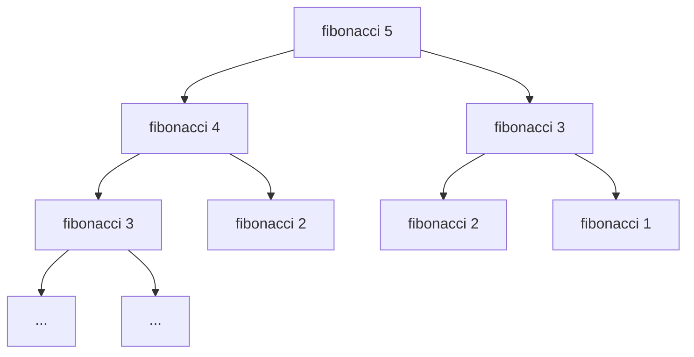

# Fibonacci-Zahl

Schreibe eine Funktion `fibonacci(n)`, die die `n`-te Zahl der
**Fibonacci-Folge** zurückgibt.

## Definition

$$F_0 = 0, \quad F_1 = 1, \quad F_n = F_{n-1} + F_{n-2} \text{ für } n \ge 2$$

## Beispiele

| n  | F(n) |
|---:|-----:|
|  0 |    0 |
|  1 |    1 |
|  2 |    1 |
|  3 |    2 |
|  5 |    5 |
| 10 |   55 |

## Worauf zu achten ist

- Eine **rekursive** Lösung ist sehr kurz, hat aber **exponentielle Laufzeit**
  -- bei `n = 30` werden bereits über 1,3 Mio. Funktionsaufrufe ausgefuehrt
- Eine **iterative** Lösung laeuft in **linearer Zeit** $O(n)$ und
  konstantem Speicher
- Mit `functools.lru_cache` lassen sich rekursive Aufrufe **memoisieren**
  und damit ebenfalls auf $O(n)$ drücken

## Vergleich der Ansätze

Die naive Rekursion berechnet `fibonacci(3)` und `fibonacci(2)` mehrfach.
Memoisierung speichert Ergebnisse und vermeidet Doppelarbeit.
